= Description of data

All the data used here is taken from statec.lu .

== Monthly electricity supply (in million kWh)

* Data used to produce the plots below can be downloaded link:https://github.com/tarikgit/julia-lux/blob/gh-pages/data/a4102.csv[here: csv data]
* link:http://www.statistiques.public.lu/stat/ReportFolders/ReportFolder.aspx?IF_Language=fra&MainTheme=1&FldrName=4[Download data here] by following _Conjoncure énergétique_ -> _Approvisionnement mensuel en électricité (en kWh) ..._

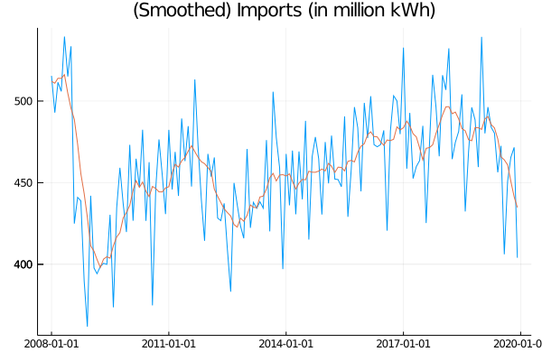 

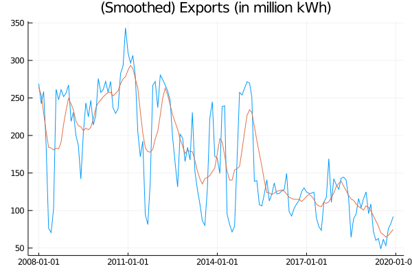 

== Atmospheric pressure in Luxembourg City

* Data used to produce the plots below can be downloaded link:https://github.com/tarikgit/julia-lux/blob/gh-pages/data/a2105.csv[here: csv data]
* link:https://statistiques.public.lu/stat/ReportFolders/ReportFolder.aspx?IF_Language=fra&MainTheme=1&FldrName=2[Download data here] by following _Pression atmosphérique à Luxembourg-Ville ..._

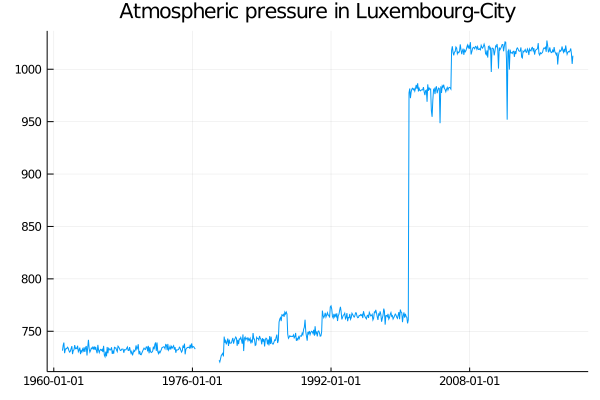 

== Education in Luxembourg

* Data used to produce the plots below can be downloaded link:https://github.com/tarikgit/julia-lux/blob/gh-pages/data/c6300revised.csv[here: csv data]
* link:https://statistiques.public.lu/stat/ReportFolders/ReportFolder.aspx?IF_Language=fra&MainTheme=3&FldrName=6&RFPath=59[Download data here] by following _Enseignement postprimaire_ -> _Élèves dans l'enseignement postprimaire 1991/1992 - 2017/2018 (version révisée) ..._

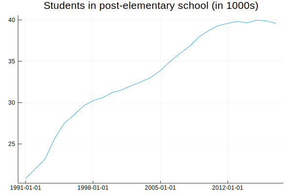 

== Inflation and CPI

Consumer price index (NCPI Base 100 au 1.1.1948) 1948 - 2020

* Data used to produce the plots below can be downloaded link:https://github.com/tarikgit/julia-lux/blob/gh-pages/data/e5100.csv[here: csv data]
* link:http://www.statistiques.public.lu/stat/ReportFolders/ReportFolder.aspx?IF_Language=eng&MainTheme=5&FldrName=5[Download data here] by following _Consumer price index ..._

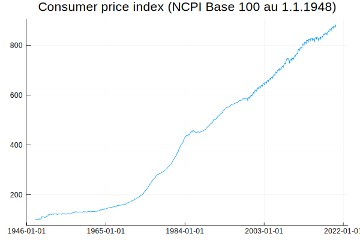 

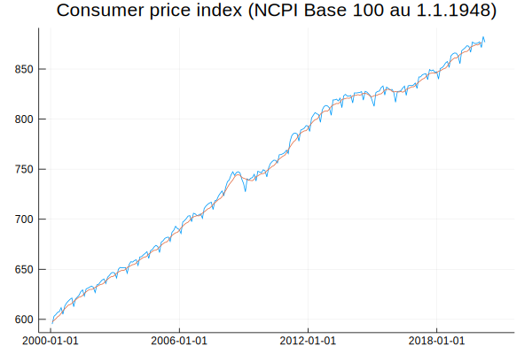 

== Population

* link:https://statistiques.public.lu/stat/ReportFolders/ReportFolder.aspx?IF_Language=eng&MainTheme=2&FldrName=1[Download data here] by following _Consumer price index ..._

== Real Estate

* Data used to produce the plots below can be downloaded link:https://github.com/tarikgit/julia-lux/blob/gh-pages/data/a1101.csv[here: csv data]
* link:https://statistiques.public.lu/stat/ReportFolders/ReportFolder.aspx?IF_Language=eng&MainTheme=1&FldrName=1[Download data here] by following _Land use (in %) ..._

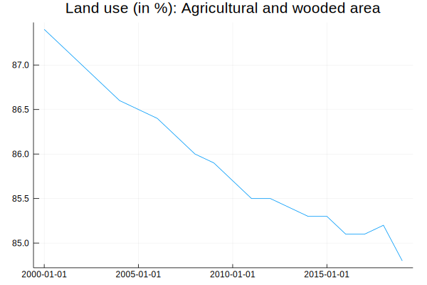 

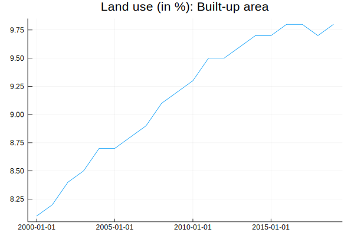 

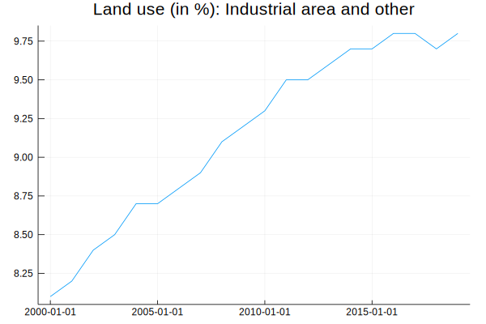 

* link:http://observatoire.liser.lu/prixenregistres.cfm?pageKw=pe_appart_tableaux_recap2[Observed real estate prices] from the _Observatoire de l'habitat_ .

* Data used to produce the plots below can be downloaded link:https://github.com/tarikgit/julia-lux/blob/gh-pages/data/Prix_moyen_au_metre_carre_enregistre_par_commune.csv[here: csv data]

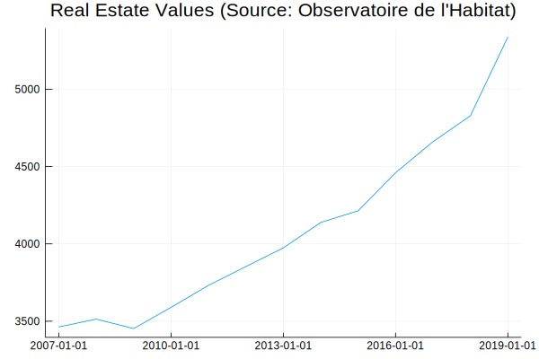 

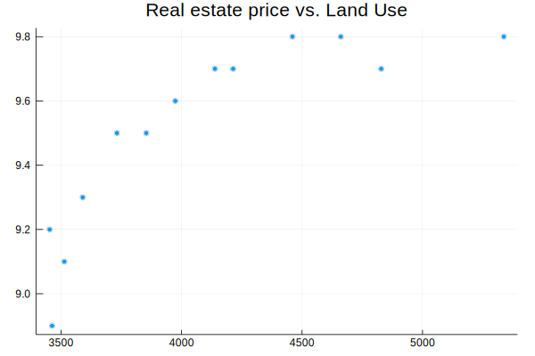 